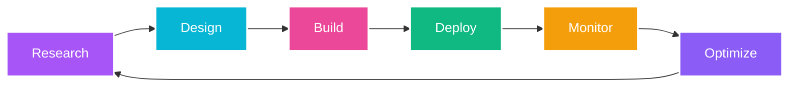

# 🧠 EPIOW

### The Future of Intelligent Systems

**Next-generation AI solutions that transform businesses into autonomous, intelligent enterprises**

---

## 🚀 Who We Are

**Epiow Limited** is a UK-based AI application development company specializing in cutting-edge artificial intelligence solutions. We architect systems that don't just process data—they learn, adapt, and evolve autonomously.

> *"We're building the future where AI isn't just a tool, but a fundamental transformation of how businesses operate."*

---

## 💡 Our Vision

<table>
<tr>
<td width="25%" align="center">
<h3>🎯</h3>
<h4>Autonomous Intelligence</h4>
Self-learning systems that adapt without human intervention
</td>
<td width="25%" align="center">
<h3>🔮</h3>
<h4>Neural Architecture</h4>
Advanced deep learning built on transformer models
</td>
<td width="25%" align="center">
<h3>💻</h3>
<h4>Cognitive Computing</h4>
AI that understands context and complex reasoning
</td>
<td width="25%" align="center">
<h3>🌐</h3>
<h4>Distributed AI</h4>
Edge-to-cloud infrastructure for global scale
</td>
</tr>
</table>

---

## 🛠️ Enterprise Solutions

| Solution | Focus Areas | Key Technologies |
|----------|-------------|------------------|
| **🧠 Neural AI Systems** | Deep learning, transformers, reinforcement learning | TensorFlow, PyTorch, JAX |
| **⚡ Edge AI Computing** | On-device ML, real-time processing | Distributed Intelligence, IoT |
| **💬 Conversational AI** | NLP, multi-modal chat, sentiment analysis | GPT-4, Claude, Gemini |
| **👁️ Computer Vision** | Object detection, video analytics, 3D reconstruction | OpenCV, YOLO, SAM |
| **📊 Predictive Analytics** | Forecasting, anomaly detection, time series | Statistical ML, Neural Networks |
| **🏗️ AI Infrastructure** | MLOps, model serving, auto-scaling | Kubernetes, Docker, Serverless |

---

## 🎯 Technology Stack

### ML & AI Frameworks

### Cloud & Infrastructure

### Languages

### LLMs & Foundation Models

---

## 🌟 Why Choose Epiow?

| Metric | Value | Description |
|--------|-------|-------------|
| ⚡ **Performance** | <100ms | Ultra-low latency response times |
| 🛡️ **Reliability** | 99.9% | Enterprise-grade uptime guarantee |
| 🤖 **AI-Powered** | 24/7 | Continuous autonomous monitoring |
| 🌍 **Global Scale** | Multi-region | Edge deployment worldwide |
| 🔒 **Security** | SOC2 Ready | Enterprise security standards |
| 📈 **Scalability** | Auto-scaling | Elastic infrastructure |

---

## 📂 Featured Repositories

| Repository | Description | Tech Stack |
|------------|-------------|------------|
| **[website](https://github.com/EpiowAI/website)** | Official company website with cyber-themed design | SolidJS, Bun, PandaCSS, TypeScript |

*More open-source projects coming soon...*

---

## 🎨 Our Design Philosophy

We believe in **cyber-aesthetic meets enterprise functionality**:

- 🎨 **Cyber Purple** (#a855f7) - Innovation & creativity
- ⚡ **Electric Cyan** (#06b6d4) - Technology & precision
- 💎 **Neon Pink** (#ec4899) - Bold & transformative
- 🌌 **Deep Space Dark** - Sophistication & depth

---

## 📈 Our Approach

**Continuous Innovation Cycle:**
1. 🔬 **Research** - Cutting-edge AI/ML research
2. 🎨 **Design** - User-centric system architecture
3. 🛠️ **Build** - Production-grade implementation
4. 🚀 **Deploy** - Global edge deployment
5. 📊 **Monitor** - 24/7 AI-powered monitoring
6. ⚡ **Optimize** - Continuous improvement

---

## 💼 Industries We Serve

| Industry | Applications | Impact |
|----------|--------------|--------|
| 🏦 **Finance** | Fraud detection, algorithmic trading, risk assessment | Real-time threat prevention |
| 🏥 **Healthcare** | Diagnostic AI, patient monitoring, drug discovery | Improved patient outcomes |
| 🏭 **Manufacturing** | Predictive maintenance, quality control, supply chain | Reduced downtime |
| 🛒 **Retail** | Personalization, demand forecasting, inventory optimization | Increased efficiency |
| 🚗 **Automotive** | Autonomous systems, predictive analytics, IoT | Enhanced safety |
| 🎓 **Education** | Adaptive learning, content generation, assessment | Personalized education |

---

## 🌍 Global Reach, Local Expertise

**🇬🇧 Headquartered in the United Kingdom**

Serving clients across **Europe**, **North America**, **Asia-Pacific**

*Building intelligent systems that transcend borders*

---

## 🤝 Let's Build Together

We're always looking to collaborate with forward-thinking organizations ready to embrace the AI revolution.

### Get In Touch

### Follow Our Journey

---

### 🚀 Building the Future of Intelligent Systems

**Copyright © 2025 Epiow Limited. All rights reserved.**

*Transforming businesses through autonomous AI • United Kingdom*

